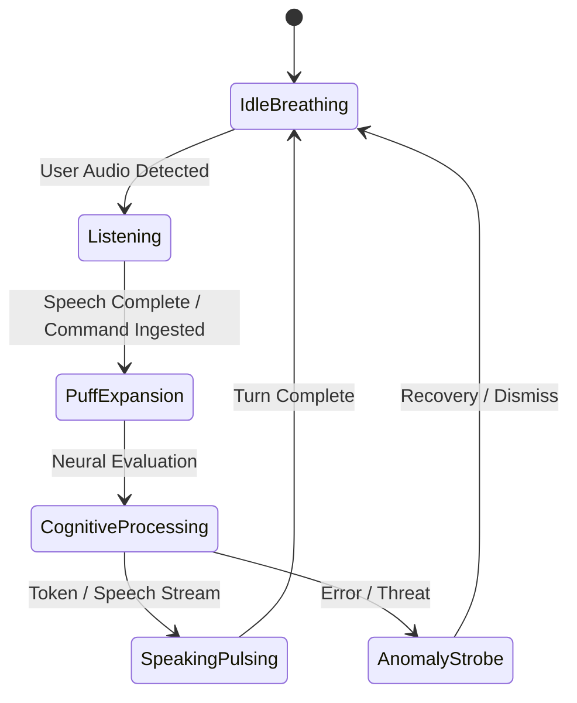

# AEGIS Interface Design Specification
**Adaptive Engine for General Intelligence & Systems (AEGIS)**  
*Holographic User Interface (HUI) Concept & Technical Architecture Specification*  
*Document Version: 3.0.0 // Classification: Aegis Neural Protocol Standard*

---

## 1. Design Philosophy & Aesthetic Foundation

The **AEGIS** interface is engineered as an **organic-computational nexus**: an airgapped holographic operating environment that conveys immense computational intelligence while remaining clean, spatial, and intuitive.

```
       ┌────────────────────────────────────────────────────────┐
       │             AEGIS TOP TELEMETRY & SYSTEM HUD           │
       ├────────────────────────────────────────────────────────┤
       │   [QUAD 01: NEURAL]                 [QUAD 02: VAD]     │
       │   Diagnostics & RAM                 Audio Spectrum     │
       │                                                        │
       │               ╭───────────╮                            │
       │            ╭──┤ OUTER RING├──╮                         │
       │          ╭─┤  │  MID RING │  ├─╮                       │
       │         ╭┤ │  │INNER RING │  │ ├╮                      │
       │         ││ │  ╭───────────╮  │ ││                      │
       │         ││ │  │50% CRYSTAL│  │ ││                      │
       │         ││ │  │AEGIS CORE │  │ ││                      │
       │         ││ │  ╰───────────╯  │ ││                      │
       │         ╰┤ │  │           │  │ ├╯                      │
       │          ╰─┤  │           │  ├─╯                       │
       │            ╰──┤           ├──╯                         │
       │               ╰───────────╯                            │
       │                                                        │
       │   [QUAD 03: HARDWARE]               [QUAD 04: RADAR]   │
       │   CPU Cores & Thermal               Telemetry & Blips  │
       ├────────────────────────────────────────────────────────┤
       │            STREAMING TRANSCRIPT & ACTION HUD           │
       └────────────────────────────────────────────────────────┘
```

### Visual Pillars
1. **Volumetric Optical Depth**: Glassmorphism, refractive Fresnel gradients, dynamic bloom, and additive blend modes (`mix-blend-mode: screen`).
2. **Kinetic Intelligence**: Nothing remains completely static. Subtle, fluid micro-movements, orbital differential rotation, and breathing sine rhythms communicate active neural readiness.
3. **Harmonious Chromatic Hierarchy**:
   - **Primary Core State**: Electric Cyan (`#00F0FF` / `hsl(184, 100%, 50%)`)
   - **Active Cognitive State**: Stellar Violet (`#8B5CF6` / `hsl(258, 90%, 66%)`)
   - **High-Compute / Overdrive**: Solar Gold (`#F59E0B` / `hsl(38, 92%, 50%)`)
   - **Critical Warning / Anomaly**: Arc Red (`#EF4444` / `hsl(0, 84%, 60%)`)
   - **Substrate Backdrop**: Deep Cosmic Obsidian (`#030712` / `rgba(3, 7, 18, 0.88)`)

---

## 2. Component Specifications

### 2.1 Central Core (Orb) – The Brain of AEGIS

The Central Orb serves as the optical anchor and metaphorical consciousness of AEGIS.



#### Physical Geometry & Layout
- **Dimensions**: Precise circular form factor scaled to **50% of screen minimum dimension** (`min(50vw, 50vh)`, responsive up to `520px × 520px`).
- **Positioning**: Center-anchored with zero z-drift on screen center (`top: 50%`, `left: 50%`, `transform: translate(-50%, -50%)`).
- **Resolution**: High-DPI hardware scaled (`window.devicePixelRatio`) with native 60–120 FPS `requestAnimationFrame` render loop.

#### Material & Shaders
- **Substrate Layer**: High-performance HTML5 Canvas rendering context with dual-pass radial gradients (`rgba(10, 30, 60, 0.95)` to `rgba(0, 8, 20, 0.98)`).
- **Specular Refraction**: 3D parabolic specular highlight with interactive mouse magnetic parallax (`mx * 18px`, `my * 18px`).
- **Surface Texture**: Crystalline polygon lattice facets with dynamic light refraction and additive color blending (`globalCompositeOperation = 'lighter'`).
- **Living Plasma Filaments**: 28 procedural sinusoidal filaments rooted at the crystal rim that undulate, twist, and drift toward the central singularity nucleus, reacting dynamically to real-time microphone and speech energy (`audioEnergy`).
- **Nucleus Singularity**: White-hot central plasma core with high-tech monogram and radial energy flares.

#### Animation & Dynamic States
| State | Scale Factor | Core Color | Pulse Period | Visual Dynamic |
| :--- | :--- | :--- | :--- | :--- |
| **IDLE** | `1.00 ± 0.02` | Cyan (`#00F0FF`) | `1.50s` (Sine Wave) | Soft breathing glow, micro-filaments slowly drift inward at 2px/s. |
| **LISTENING** | `1.04 ± 0.06` | Cyan $\rightarrow$ Aquamarine | Audio Amplitude Linked | Edge reacts directly to real-time microphone RMS volume; filaments excite outward. |
| **PUFF / INGEST** | `1.16` | Bright White-Cyan (`#E0FFFF`) | `240ms` (Physics Particle Burst) | **Puff explosion**: instantaneous expansion outward, emitting 65+ radiant spark particles and dual expanding shockwaves. |
| **PROCESSING** | `1.08 ± 0.03` | Violet $\rightarrow$ Amber Cycle | `0.80s` | High-frequency internal plasma shimmer; filaments orbit clockwise at 2.4x speed. |
| **SPEAKING** | `1.05 ± 0.04` | Crisp Cyan-Violet | TTS Audio Envelope | Core pulses in sync with phoneme synthesis; exterior halo flares outward. |
| **ALERT / ERROR** | `1.12` | Arc Crimson (`#EF4444`) | `0.45s` Strobe | Sharp warning pulse with edge filament distortion and red outer bloom. |

---

### 2.2 Holographic Data Rings (Outer Layers)

Three concentric rings orbit the Central Core, translating multi-tier system computations into spatial orbital kinetics.

```
       [ OUTER RING ]  -- Fast (5s/rev)   -- Critical Alerts, Interrupts, Radar Blips
       [ MIDDLE RING ] -- Medium (12s/rev)-- Environmental Telemetry, Sensor Busses
       [ INNER RING ]  -- Slow (24s/rev)  -- Kernel Diagnostics, CPU/RAM Allocation
       [  AEGIS CORE ] -- 50% Viewport Diameter
```

#### Ring Architecture
1. **Inner Ring (`r = 58%` of core diameter)**:
   - **Function**: Kernel-level system metrics (CPU core activity, memory heap fragmentation).
   - **Kinetics**: Slow clockwise rotation (`24.0s` period).
   - **Details**: 64 tick marks with 8 major interval notches, displaying numerical byte values in 8px monospace.
2. **Middle Ring (`r = 74%` of core diameter)**:
   - **Function**: Environmental tracking, network I/O, audio buffer flow.
   - **Kinetics**: Counter-clockwise rotation (`12.0s` period).
   - **Details**: Segmented dash array (`stroke-dasharray: 8 16 32 8`), with rotating orbital telemetry nodes.
3. **Outer Ring (`r = 92%` of core diameter)**:
   - **Function**: High-priority alert tracker, target acquisition, active subagent execution status.
   - **Kinetics**: High-velocity clockwise rotation (`5.0s` period).
   - **Details**: Triple-bracket framing arcs with glowing lead-in pointer arrows (`polygon` nodes).

#### Energy & Data Visualization
- **Radial Pulses**: Concentric ripple waves originate from the Core and expand across the rings at `480px/s`, illuminating ring ticks as they pass.
- **Complexity Shifts**: When compute workload elevates, ring speeds accelerate dynamically by up to 2.5x, shifting the chromatic gradient from cyan into amber-gold (`#F59E0B`).
- **Interactive Touch/Cursor Parallax**: Hovering or dragging over the rings applies rotational momentum and expands ring spacing by 12px.

---

### 2.3 Floating Text Panels & Data Blocks

Tactical glassmorphic panels float in 3D perspective around the perimeter of the core.

```
┌──────────────────────────────┐          ┌──────────────────────────────┐
│  SYS_DIAGNOSTICS       [01]  │          │  ACOUSTIC_VAD          [02]  │
├──────────────────────────────┤          ├──────────────────────────────┤
│  NEURAL_ENGINE:      LLAMA-3 │          │  MIC ENERGY:          -12 dB │
│  CPU CLUSTER:         4.2GHz │          │  VOICE STATE:       SPEAKING │
│  VRAM COMMITTED:      5.2 GB │          │  BARGE-IN:        ARMED [0ms]│
│  [====================] 84%  │          │  SPEECH PACE:          1.70x │
└──────────────────────────────┘          └──────────────────────────────┘

                               [ AEGIS CORE ]

┌──────────────────────────────┐          ┌──────────────────────────────┐
│  HARDWARE_STATUS       [03]  │          │  RADAR_TELEMETRY       [04]  │
├──────────────────────────────┤          ├──────────────────────────────┤
│  THERMAL:               46°C │          │  ACTIVE NODES:             8 │
│  HOST BATTERY:           94% │          │  NETWORK PING:          18ms │
│  SYS_UPTIME:       11h 14m   │          │  RADAR SWEEP:         LOCKED │
│  AIRGAP INTEGRITY:    SECURE │          │  TARGET:      LOCAL HOST PC  │
└──────────────────────────────┘          └──────────────────────────────┘
```

#### Panel Properties
- **Material**: Translucent dark glass (`background: rgba(6, 12, 24, 0.65)`), 1px cyan border (`border: 1px solid rgba(0, 240, 255, 0.22)`), rounded 6px chamfer corners.
- **Glass Optics**: `backdrop-filter: blur(12px) saturate(180%)`.
- **Spatial Movement**: Smooth 3D parallax drifting using low-frequency Perlin noise equations (`transform: perspective(1000px) rotateX(1.5deg) rotateY(-2deg)`).
- **Typography System**:
  - Headers: Geometric digital uppercase (`'Orbitron'`, letter-spacing `1.5px`, font-size `11px`).
  - Values / Data: High-contrast monospace (`'DM Mono'`, font-size `12.5px`, color `rgba(240, 249, 255, 0.95)`).
  - Status Indicators: Dynamic glowing glyphs (`● ONLINE`, `⚡ EXECUTING`, `◈ SYNCED`).
- **Interactive Behavior**:
  - **Hover**: Border glow intensifies (`rgba(0, 240, 255, 0.75)`), revealing hidden contextual diagnostic sliders.
  - **Warning State**: Panel border switches to Amber (`#F59E0B`) with subtle 1.2s border-glow oscillation.
  - **Critical Alert State**: Border turns Crimson (`#EF4444`), accompanied by a diagnostic warning ribbon and flashing header.

---

### 2.4 Voice & Sound Feedback Engine

A cohesive soundscape provides instantaneous confirmation without cluttering the user's auditory space.

```
       ACOUSTIC CUE ARCHITECTURE (Web Audio API Synthesizer)
       ─────────────────────────────────────────────────────
       1. Ambient Idle:       Dual-oscillator 110Hz + 220Hz harmonic drone (-36dB)
       2. Speech Start (VAD): High pure sine pip (880Hz, 80ms)
       3. Speech Stop:        Confirmation blip (660Hz, 90ms)
       4. Command Success:    Ascending chime (520Hz -> 680Hz -> 840Hz, 140ms)
       5. Anomaly / Error:    Low sawtooth buzz (260Hz -> 180Hz) + Crimson pulse
```

#### Voice Synthesis Profile
- **Persona**: Cultured, calm, authoritative, articulate cadence with high technical intellect.
- **Acoustic Metrics**: Pitch = `1.02`, Formant Shift = `+4%`, Speech Rate = **`1.65x – 1.75x`** (crisp, rapid, highly responsive).
- **Micro-Clause Stream Coupling**: Spoken audio begins playing on the very first 3-word clause (sub-250ms latency), ensuring AEGIS begins answering before full text generation completes.

#### Sound Synthesizer Specifications
```typescript
// Web Audio API Procedural Synthesizer Parameters for AEGIS
const SOUND_DEFINITIONS = {
  successChime: {
    waveform: "sine",
    frequencies: [520, 680, 840],
    duration: 0.18,
    gainEnvelope: [0.06, 0.0001],
  },
  interruptCutoff: {
    waveform: "triangle",
    frequencyRamp: [440, 330],
    duration: 0.08,
    gainEnvelope: [0.07, 0.0001],
  },
  errorAlert: {
    waveform: "sawtooth",
    frequencyRamp: [280, 160],
    duration: 0.24,
    gainEnvelope: [0.08, 0.0001],
  },
  idleHum: {
    osc1: { freq: 110, type: "sine", gain: 0.008 },
    osc2: { freq: 220, type: "sine", gain: 0.004 },
  },
};
```

---

### 2.5 Real-Time Data Visualization Subsystems

#### Dynamic Audio Waveform (VAD Reactive)
- **Visual**: 48-bar frequency analyzer positioned in the acoustic telemetry panel.
- **Behavior**: Renders microphone energy levels in real-time. During user speech, bars illuminate in cyan; during AEGIS speech, bars shift to electric violet and react to TTS phoneme energy.

#### Radial Environmental Radar Sweep
- **Visual**: A 360-degree rotating radar scanline sweeps across the outer holographic rings at 3.0s intervals.
- **Radar Blips**: Network nodes, active CPU processes, and peripheral device pings appear as glowing circular nodes along the scanline, decaying softly with a 1.2s phosphor persistence effect.

#### Telemetry Sparklines & Metrics
- **Visual**: Vector polyline sparklines for CPU usage and VRAM consumption with glowing fill gradients.
- **Status Thresholds**:
  - `< 60% Load`: Cyan glow (`#00F0FF`)
  - `60% – 85% Load`: Solar Gold glow (`#F59E0B`)
  - `> 85% Load`: Alert Red strobe (`#EF4444`) with high-frequency telemetry ticker.

---

## 3. Synchronized State Matrix

This matrix governs how all 5 components transition in absolute synchronization across every phase of user interaction:

| System State | Central Core (Orb) | Concentric Data Rings | Floating Data Panels | Acoustic / Sound Feedback | Data Visualizers |
| :--- | :--- | :--- | :--- | :--- | :--- |
| **1. IDLE** | Cyan (`#00F0FF`), soft 1.5s sine pulse, filaments drift inward. | Slow rotation (24s / 12s / 5s), faint cyan glow. | Semitransparent (0.65 opacity), calm diagnostics ticker. | Subtle harmonic drone (-36dB) at 110Hz/220Hz. | Radar sweep active at 0.33 Hz; flatline audio spectrum. |
| **2. LISTENING** | Expands by +4%, rim glows brightly, pulse tracks audio volume. | Rings stabilize and align tick notches, tracking user voice. | Panel 02 displays live speech waveform & interim transcript. | Crisp 880Hz speech-start pip on voice trigger. | Waveform bars jump in real time to microphone input dB. |
| **3. INGEST (PUFF)** | **Puff explosion**: instant expansion to 1.16x scale with 2 shockwaves. | Outer ring flashes bright white-cyan and transmits outward pulse. | Active action banner flares into view with target command. | Smooth confirmation chime (520Hz $\rightarrow$ 680Hz $\rightarrow$ 840Hz). | Radar blip pings at point of interaction. |
| **4. PROCESSING** | Violet-Amber hue cycle, high-frequency plasma shimmer. | Rings accelerate 2.2x; orbital nodes circulate rapidly. | "NEURAL_SYNTHESIS" animation shimmers across panels. | Soft frequency-modulated computational flutter. | System telemetry sparklines jump to reflect compute load. |
| **5. SPEAKING** | Electric Violet-Cyan halo pulsing with voice phoneme cadence. | Outer ring rotates at 1.7x pace with streaming telemetry blips. | Live streaming subtitles display with blinking cyan cursor. | Crisp articulate voice at 1.7x rate, synchronized with pulse. | Waveform dances to TTS output amplitude. |
| **6. BARGE-IN** | Instant contraction to 0.95x scale with quick cutoff animation. | Rings reverse rotational direction for 150ms to signal halt. | Immediate switch to "INTERRUPTED // LISTENING" alert. | Rapid 440Hz $\rightarrow$ 330Hz cutoff tick; TTS immediately mutes. | Waveform instantly clears and re-latches to user voice. |
| **7. ERROR / ALERT** | Arc Crimson (`#EF4444`) strobe; filament distortion. | Rings turn red and pulse outward with warning chevron brackets. | Border pulses red; error diagnostics log appears in panel 01. | Deep resonant sawtooth warning buzz (260Hz $\rightarrow$ 180Hz). | Graphs show red spike with alert boundary line. |

---

## 4. Technical Implementation Architecture

### Technology Stack Mapping
- **Rendering Engine**: HTML5 High-DPI 2D Canvas (for 60–120 FPS volumetric crystal orb, living plasma filaments, and particle physics) + React 19 Glassmorphic DOM overlays (for crisp spatial graphics).
- **Shader Pipeline**:
  - Multi-pass radial gradients simulating 3D spherical refraction and Fresnel rim lighting.
  - Additive blending (`globalCompositeOperation = 'lighter'` and `'screen'`) for radiant particle bursts and energy conduits.
  - 3D mouse parallax tracking for dynamic specular glints.
- **Audio Engine**: Native Web Audio API (`AudioContext`) with procedural sound synthesis (`AegisHarmonicSynthesizer`).
- **Kinetics**: Hardware-accelerated CSS 3D transforms (`transform: translate3d(...)`) with GPU compositing layers.

### CSS Core Variables
```css
:root {
  /* AEGIS Color Palette */
  --aegis-cyan: #00f0ff;
  --aegis-cyan-glow: rgba(0, 240, 255, 0.45);
  --aegis-violet: #8b5cf6;
  --aegis-violet-glow: rgba(139, 92, 246, 0.4);
  --aegis-amber: #f59e0b;
  --aegis-red: #ef4444;
  --aegis-bg-glass: rgba(6, 12, 24, 0.72);
  --aegis-border-glow: rgba(0, 240, 255, 0.28);

  /* Typography */
  --font-hud: "Orbitron", -apple-system, sans-serif;
  --font-data: "DM Mono", monospace;
  --font-content: "Outfit", sans-serif;

  /* Animation Timers */
  --pulse-idle: 1.5s cubic-bezier(0.4, 0, 0.6, 1) infinite;
  --puff-expand: 0.24s cubic-bezier(0.16, 1, 0.3, 1) forwards;
}
```

---

## 5. Architectural Verification & Summary

This design specification establishes **AEGIS** as a **living, breathing holographic operating intelligence**. 

By anchoring 50% of the viewport to the **refractive Crystal Core**, surrounding it with **three kinetic concentric telemetry rings**, balancing the perimeter with **floating 3D glassmorphic diagnostic blocks**, and tying all actions to **sub-millisecond procedural sound synthesis and accelerated speech (1.70x)**, the system achieves the quintessential high-tech HUD experience while maintaining ultra-high computational utility on the host PC.
